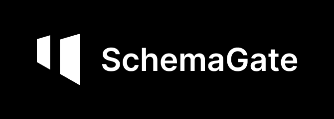

[](https://github.com/birreb/SchemaGate/actions/workflows/ci.yml)
[](https://www.python.org/downloads/)
[](LICENSE)

Document in, rows out, shaped by a PostgreSQL table you already own.

SchemaGate reads the table's definition from the live database, sends an LLM a schema built
from it, and constrains the model so the output cannot disagree with your columns. It then
checks the result and returns JSON, marking every value that failed a check and why.

Nothing is written to your database. The `INSERT` is yours, which is where a person decides
whether to run it. SchemaGate gives that person something to decide with: which row, which
column, which rule, and what the document actually said.

There is no mapping file to maintain: the table is the configuration. Alter a column and the
next upload follows it.

The page at the root is a playground for trying the API, not a place to work. No queues, no
review inbox, no accounts. Review belongs in your application, and the response carries what
it needs: per row and per column failures, the offending value, and the rule that rejected it.

```console
$ curl -s localhost:8000/v1/extract \
    -F file=@invoice.pdf \
    -F connection=primary \
    -F table=invoices
```

```json
{
  "status": "flagged",
  "table": "public.invoices",
  "route": "native_pdf",
  "rows": [
    { "invoice_number": "INV-1043", "subtotal": "1240.00", "tax": "310.00", "total": "1550.00" },
    { "invoice_number": "INV-1044", "subtotal": "890.00", "tax": "222.50", "total": "1100.00" }
  ],
  "validation": {
    "failures": [
      {
        "row": 1,
        "column": "total",
        "rule": "arithmetic",
        "detail": "subtotal + tax = total does not hold: the terms come to 1112.50, the document says 1100.00.",
        "value": "1100.00"
      }
    ]
  },
  "stages": [
    { "name": "schema",  "detail": "Read public.invoices from the database: 10 columns, 8 to extract", "ms": 4 },
    { "name": "read",    "detail": "PDF, 1 page, text_based, 842 characters via the text layer", "ms": 7 },
    { "name": "extract", "detail": "A model read text against a schema of 8 fields, returning 2 rows", "ms": 2140 },
    { "name": "check",   "detail": "2 rows, 1 failure: arithmetic", "ms": 0 }
  ],
  "unmatched_headers": [],
  "missing_columns": [],
  "timings_ms": { "parse": 7, "validate": 0 }
}
```

`flagged` is not an error. Extraction worked and a check did not hold. The rows still come
back and nothing is silently repaired, so you can insert the clean ones, queue the flagged
ones for somebody to look at, or reject the file. That decision is the point of the field.

`stages` is the path the document actually took, with what each step found and how long it
spent. On a PDF the model is always the slowest step by an order of magnitude, which is
worth being able to see rather than being asked to believe.

## How it works

```
              your PostgreSQL table
      columns, types, enums, limits, comments
                       |
                       |  read live, on every request
                       v
   document  ->  parsed  ->  model  ->  checked  ->  rows
   PDF, image     text or    working    types,       ready to
   CSV, sheet     a grid     from your  maths,       INSERT
                             schema     limits
```

1. Read the table from `pg_catalog`: column names, types, enum members, length limits, decimal
   scale, and any `COMMENT ON COLUMN` text. This runs on every request, so an altered column
   takes effect on the next upload.
2. Read the document. A PDF becomes text, a scan goes through OCR, a photo is normalised, a CSV
   or spreadsheet becomes a grid.
3. Send it to the model along with a schema built from step 1.
4. Check what comes back: types, lengths, enum members, any rules you set, and whether the
   document names rows that did not come back.
5. Return JSON shaped like the table. You run the `INSERT`; SchemaGate never writes.

### What the model does

| File | Model's job |
| --- | --- |
| PDF, scan, photo | read the document and return the rows |
| spreadsheet, CSV | match the headings to your columns |

A spreadsheet already holds the values in a grid, so the model only decides what each heading
means (`Fakturanr` is `invoice_number`) and the values are copied by code. Headings that match
by spelling skip the model entirely. Answers are cached per heading set and table.

Transcribing a 5,000 row export would cost about $3.60 against $0.0001 for the headings, and a
model rewriting that many rows can drop one or change a digit.

### Constrained output

The schema is sent with the request and the provider restricts generation to it. A column you
do not have, a value outside your enum, and a field of the wrong type are not expressible.

This constrains the shape, not the content. Values can still be wrong, which is what step 4 is
for.

## Benchmark

A document and a live PostgreSQL database, four ways, with the same model in every approach.
The naive approach sends the whole database schema and the document and asks for JSON rows, or
for INSERT statements. An ablation sends one table's DDL and the text layer and asks for free
JSON. SchemaGate reads the table from `pg_catalog`, constrains the output to it, and runs the
gate. Every answer is inserted into the real table inside a transaction that is rolled back,
so PostgreSQL decides what is insertable, and what landed is compared cell by cell with what
the document says.

88 generated cases: 45 invoices in eight layouts and five locales, 10 supplier statements,
15 line-item sets, 12 receipt photographs and 6 exports of 50 to 2,000 rows. Five invoices
have a printed total that does not add up. Method, documents and the full results are in
[bench/README.md](bench/README.md).

A full run with gpt-oss-120b on Cerebras, 2 September 2026. A text-only model, so the
receipts were not attempted and every approach read the same text layer.

Reading accuracy is the same for every approach, since it is the same model on the same text.
The difference is in the cells that did not land correctly, about 6% of the total, and what
became of them:


| Approach | Cells correct | Wrong value stored | Flagged or held | Rejected by DB | Inconsistent invoices caught | Tokens per document | Cost per document |
| --- | --- | --- | --- | --- | --- | --- | --- |
| whole schema + document, JSON | 92.8% | 14 | 0 | 77 | 0 of 5 | 3,840 | 0.16¢ |
| whole schema + document, SQL | 93.6% | 10 | 0 | 0 | 0 of 5 | 3,930 | 0.16¢ |
| one table + text, free JSON | 94.3% | 10 | 0 | 72 | 0 of 5 | 1,610 | 0.08¢ |
| SchemaGate | 94.1% | 1 | 87 | 0 | 5 of 5 | 1,780 | 0.08¢ |

70 documents, 1,538 cells with a known value. Cost is at Cerebras's published price for
gpt-oss-120b; on a frontier model the same token counts cost 25 to 60 times more, in the same
proportions.


Reading accuracy is the same for every approach, 93 to 94% of cells, since it is the same
model on the same text with the same column comments. What differs is what reaches the table
without a warning: SchemaGate let one wrong value and three blanks through in 1,538 cells,
flagged or held 87 for a person, including two statements reported as incomplete with the
skipped invoice numbers named, and had no row rejected by the database. The other approaches
let 10 to 14 wrong values and 5 to 23 blanks through, lost 66 to 77 cells to database errors
or rows that never came back, and flagged nothing. On spreadsheets the rows never reach a
model: 100% of 4,000 rows for a tenth of a cent in total, where the naive approaches are
unreliable from 200 rows and cost 8 to 10 cents.

## Built on

Python 3.11 to 3.14. The parsing is Rust underneath, the rest is small.

| Part | What | Notes |
| --- | --- | --- |
| HTTP | [FastAPI](https://fastapi.tiangolo.com) | one endpoint, plus OpenAPI at `/openapi.json` |
| Schema | [Pydantic](https://docs.pydantic.dev) v2 | your table compiled to a model at runtime, via `create_model` |
| Postgres | [asyncpg](https://github.com/MagicStack/asyncpg) | one `pg_catalog` query, read only |
| PDF | [pdf-inspector](https://github.com/firecrawl/pdf-inspector) | Rust. Classification, layout, text, OCR routing |
| Spreadsheets | [python-calamine](https://github.com/dimastbk/python-calamine) | Rust. xlsx, xls, xlsb, ods |
| OCR | PP-OCRv6 via [ONNX Runtime](https://onnxruntime.ai) | local, optional, models fetched on first use |
| Rendering | [pypdfium2](https://github.com/pypdfium2-team/pypdfium2) | PDF pages to images for the vision fallback |
| Images | [Pillow](https://python-pillow.org) + pillow-heif | EXIF rotation, flattening, downscaling, HEIC |
| Encoding | [charset-normalizer](https://github.com/jawah/charset_normalizer) | gated: below 32 bytes it is not asked |
| Models | official `anthropic`, `openai` and `ollama` SDKs | no wrapper framework |
| Tooling | [uv](https://docs.astral.sh/uv), ruff, mypy strict, pytest | 400+ tests, CI on 3.11 to 3.14 |

Two things it deliberately does not use. **No LLM framework**: LangChain, LlamaIndex and
Instructor all sit between this and the provider SDKs, and Instructor in particular pins
`anthropic` to an exact version and defaults to tool calling rather than native structured
output. **No hosted parsing service**: LlamaParse and similar are cloud only below their
enterprise tier, and the point of this is that documents stay on your network.

## Requirements

- A PostgreSQL database with a table to extract into. SchemaGate needs only `SELECT` on
  `pg_catalog`, which every role has, and does not write.
- Docker, or Python 3.11 or newer.
- For PDFs, a model: Anthropic, OpenAI, any OpenAI-compatible endpoint, or a local
  [Ollama](https://ollama.com). Spreadsheets and CSVs need no model at all.
- For scanned PDFs, `pip install 'schemagate[ocr]'`. OCR runs locally, so a scan never leaves
  your network. Separate because it adds about 20 MB of shared libraries.

## Install

The core is the schema compiler, the validation gate and the tabular path. Everything with a
heavyweight dependency is an extra, so a deployment reading spreadsheets into Postgres does
not install three model SDKs and an imaging library.

```console
$ pip install 'schemagate[server,postgres,anthropic]'   # a typical service
$ pip install 'schemagate[postgres,anthropic]'          # library only, no HTTP
$ pip install 'schemagate[all]'                         # everything
```

| Extra | Installs | Needed for |
| --- | --- | --- |
| `server` | FastAPI, uvicorn | the HTTP service and the `serve` command |
| `postgres` | asyncpg | reading table definitions from a live database |
| `pdf` | pdf-inspector, Pillow | PDFs with a text layer |
| `ocr` | ONNX Runtime, PDFium, and `pdf` | scanned PDFs, read locally |
| `images` | Pillow, pillow-heif | photographs and screenshots |
| `anthropic`, `openai`, `ollama` | that provider's SDK | extracting with it |

Using a route whose extra is not installed raises an error naming the extra to install.

## Use it as a library

`process` takes a file, a table definition and an extractor, and returns validated rows. The
HTTP endpoint is one caller of it.

```python
import asyncio

from schemagate import ColumnSpec, TableSchema, make_extractor, process

table = TableSchema(
    schema="public",
    name="invoices",
    columns=(
        ColumnSpec(name="invoice_number", data_type="text", nullable=False, ordinal=1),
        ColumnSpec(name="total", data_type="numeric", nullable=False, ordinal=2, numeric_scale=2),
    ),
)

result = asyncio.run(
    process(
        open("invoice.pdf", "rb").read(),
        "invoice.pdf",
        table,
        extractor=make_extractor("anthropic"),
    )
)

print(result.rows, result.spend.cost_usd)
```

Read the table from your own database with `PoolSchemas`, or build a `TableSchema` by hand as
above. Neither path needs the `server` extra.

To add the endpoints to an application you already have, use `install` rather than
`app.mount`. Starlette does not run a mounted application's lifespan, so a mounted SchemaGate
never builds its pool and fails on every request.

```python
from contextlib import asynccontextmanager

from fastapi import FastAPI
from schemagate import install, shutdown


@asynccontextmanager
async def lifespan(app: FastAPI):
    yield
    await shutdown(app)  # closes only the pool it built for itself


app = FastAPI(lifespan=lifespan)
install(app)  # reads SCHEMAGATE_* from the environment
```

Pass your own `settings=`, `schemas=` or `extractor=` to `install` if you would rather not
configure it through the environment. Skipping `shutdown` leaks connections at exit and
nothing else.

## Try it in one command

Starts a throwaway Postgres with an example `invoices` table and runs SchemaGate against it:

```console
$ docker compose -f examples/compose.demo.yaml up
```

Open <http://localhost:8000>, set the connection to `demo` and the table to `invoices`, and
drop in `examples/invoices-european.csv`. It is semicolon delimited with comma decimals, and
its last row does not add up, so you see the separator handling and the arithmetic check at
once.

## Quickstart against your own database

```console
$ cp .env.example .env      # then set SCHEMAGATE_CONNECTIONS
$ docker compose up
```

Open <http://localhost:8000> for a page to try it by hand, or post to `/v1/extract`. The main
compose file starts SchemaGate and nothing else, so it can never point you at a database other
than the one you configured.

Without Docker:

```console
$ pip install 'schemagate[server,postgres,anthropic]'
$ schemagate check                    # says what is configured, connects to nothing
$ schemagate serve
```

The service validates its configuration at startup and refuses to run without it, naming the
variable it needs. A misconfigured deployment fails immediately rather than an hour later.

## The playground

`http://localhost:8000` serves a single page for trying the API by hand: pick a connection and
a table from what the database actually has, choose a provider and model, drop a file, and see
the rows come back with any failed check marked on the cell it belongs to.

It is not a dashboard and not the product. It exists so the API can be judged in the first
minute, and it calls the same public endpoints anything else would. Everything on the page is
inline, with a test enforcing it, because the service is meant to run inside a private network
where a request to a font host would simply fail.

Setting a provider and key in the page requires `SCHEMAGATE_ALLOW_REQUEST_CREDENTIALS`, since
that sends a credential over HTTP. The key stays in the browser, is used once, and is never
stored on the server or written to a log.

## Providers

| Provider | Notes |
| --- | --- |
| `anthropic` | Claude. Defaults to `claude-opus-5`. |
| `openai` | GPT. The model must be named, since OpenAI's names change often. |
| `openai_compatible` | Anything speaking the OpenAI API at another address: Groq, OpenRouter, Together, DeepSeek, vLLM, LM Studio, and Gemini's compatibility endpoint. Needs `base_url`. |
| `ollama` | Local. No key, and the document never leaves your network. |

One adapter covers the third row rather than one per vendor. Adding another
OpenAI-compatible service costs nothing but a URL.

The hosts built for speed serve open models at a fraction of a frontier model's price, and
a one-page invoice needs about 1,500 tokens, so this is where most deployments should start:

```
SCHEMAGATE_PROVIDER=openai_compatible
SCHEMAGATE_OPENAI_BASE_URL=https://api.cerebras.ai/v1
SCHEMAGATE_OPENAI_MODEL=gpt-oss-120b
OPENAI_API_KEY=<the host's key>
```

Groq, Together, Fireworks and DeepInfra work the same way with their own URL and key. These
hosts differ in which models honour schema-constrained output. Where one declines, the
pipeline asks for plain JSON, validates it against the table itself, and the `extract` stage
says so, since a wrong column that was impossible to generate and one that was rejected
afterwards are different promises.

An Anthropic key that acts in more than one workspace needs `ANTHROPIC_WORKSPACE_ID` as well,
which the SDK reads.

## What it costs

Every response says what the document cost, and so does the log line.

```json
"usage": {
  "calls": 1,
  "input_tokens": 3184,
  "cached_input_tokens": 0,
  "output_tokens": 210,
  "total_tokens": 3394,
  "cost_usd": "0.021170",
  "by_model": [{ "model": "claude-opus-5", "calls": 1, "input_tokens": 3184, "output_tokens": 210 }]
}
```

Tokens are always reported. `cost_usd` is null until you set `SCHEMAGATE_PRICES` from the
provider's pricing page, because a price hardcoded here would go stale without anyone noticing.

`by_model` lists every model that ran. A spreadsheet whose headings need matching by meaning
pays for a small call on the otherwise free path, and it appears here like any other.

Three settings affect the bill:

- `SCHEMAGATE_EFFORT` defaults to `low`. The current models think by default at high effort,
  and extraction against a compiled schema has a fixed answer shape and nothing to reason
  about.
- `SCHEMAGATE_HEADER_MODEL` runs the heading match on a cheaper model. It compares two short
  lists of names, which does not need the model you chose for reading scans.
- CSVs and spreadsheets do not call a model at all.

To compare models on accuracy and cost together:

```console
$ schemagate evaluate --provider anthropic --model claude-haiku-4-5 \
    --prices '{"claude-haiku-4-5": {"input": 1, "output": 5}}'
```

```
case                       route        rows   cells      ms   tokens       cost
--------------------------------------------------------------------------------
invoices-csv               tabular         3   24/24      34        0          -
invoices-european          tabular         3   24/24       0        0          -
invoice-pdf                native_pdf      1     8/8    4102     3184  $0.020920
--------------------------------------------------------------------------------
3/3 cases clean, 56/56 cells (100.0%), 4136 ms, 3184 tokens, $0.020920
```

See [evals/README.md](evals/README.md) for the cases and how to add your own.

## Who may call it

Open by default. That is appropriate behind your own application and not appropriate
elsewhere, since every extraction spends money and `/v1/tables` describes your schema.

```
SCHEMAGATE_API_KEYS=sk-one,sk-two
SCHEMAGATE_RATE_LIMIT_PER_MINUTE=60
```

With keys set, every `/v1` endpoint requires one, as `Authorization: Bearer <key>` or
`X-API-Key: <key>`. `/health` stays open so a load balancer probe still works. Several keys
are accepted at once, for rotation. The playground has a field for the key and holds it in
your browser.

The rate limit is counted per key, or per client address when no keys are set. It counts in
one process, so four workers allow four times the limit. Use a gateway if you need a
distributed limit.

`SCHEMAGATE_MAX_CONCURRENT_EXTRACTIONS` bounds documents in flight, defaulting to 8. Each one
holds its upload, its rendered pages and its answer in memory at once, and OCR is CPU bound.

## Configuration

Environment variables only. No config file.

| Variable | Default | Meaning |
| --- | --- | --- |
| `SCHEMAGATE_CONNECTIONS__<name>` | at least one | One variable per connection, for example `SCHEMAGATE_CONNECTIONS__primary=postgresql://...`. Callers reference the name; a connection string is never accepted over HTTP. |
| `SCHEMAGATE_MAX_UPLOAD_BYTES` | `10485760` | Largest accepted upload. Enforced before the body is read. |
| `SCHEMAGATE_PROVIDER` | unset | `anthropic`, `openai`, `openai_compatible` or `ollama`. Unset, documents needing a model are refused rather than sent anywhere. |
| `SCHEMAGATE_ANTHROPIC_MODEL` | `claude-opus-5` | Model to extract with. |
| `SCHEMAGATE_OPENAI_MODEL` | unset | Required for `openai` and `openai_compatible`. Never defaulted, since OpenAI names change often. |
| `SCHEMAGATE_OPENAI_BASE_URL` | unset | For `openai_compatible`: Groq, OpenRouter, Together, DeepSeek, vLLM, LM Studio. |
| `SCHEMAGATE_OLLAMA_HOST` | `http://localhost:11434` | Where a local Ollama server is listening. |
| `SCHEMAGATE_OLLAMA_MODEL` | `qwen3` | Model to extract with. |
| `SCHEMAGATE_MODEL_TIMEOUT_SECONDS` | `120` | How long to wait on a model. The SDKs default to ten minutes, which holds a worker on a provider that has stopped answering. |
| `SCHEMAGATE_DATABASE_TIMEOUT_SECONDS` | `10` | How long to wait on the database. |
| `SCHEMAGATE_ALLOW_REQUEST_CREDENTIALS` | `false` | Lets a request name its own provider and key, which the playground uses. Off by default: it sends a credential over HTTP. |
| `SCHEMAGATE_INSTRUCTIONS` | `{}` | Free text passed to the model per table, for what a schema cannot say. A request may override it. |
| `SCHEMAGATE_RULES` | `{}` | Checks per table that the schema cannot express. Six kinds: `{"terms": ["subtotal", "tax"], "equals": "total"}` for a sum, `{"factors": ["quantity", "unit_price"], "equals": "line_total"}` for a product, `{"column": "vat_id", "reject": ["SE559012345601"]}` for values a column can never hold, `{"column": "vat_id", "pattern": "[A-Z]{2}[A-Z0-9]{2,12}"}` for a shape, `{"column": "vat_id", "require": true}` for a nullable column that should still be filled, and `{"column": "tax", "min": "0.01"}` or `"max"` for bounds. |
| `SCHEMAGATE_EFFORT` | `low` | How hard the model is asked to think, where the provider exposes it. Empty sends nothing, which is what an older model needs. |
| `SCHEMAGATE_HEADER_MODEL` | unset | A cheaper model for matching headings to columns by meaning. Unset, the extraction model does both. |
| `SCHEMAGATE_PRICES` | `{}` | What each model costs per million tokens, `{"claude-opus-5": {"input": 5, "output": 25}}`. Without it, tokens are reported and `cost_usd` is null. |
| `SCHEMAGATE_API_KEYS` | unset | Keys a caller must present. Comma separated or JSON. Empty leaves the endpoints open. |
| `SCHEMAGATE_RATE_LIMIT_PER_MINUTE` | `0` | Requests per minute per caller. 0 is no limit. |
| `SCHEMAGATE_MAX_CONCURRENT_EXTRACTIONS` | `8` | Documents read at once. 0 removes the bound. |

API keys are never read by this project. Each SDK picks up its own standard variable
(`ANTHROPIC_API_KEY`, `OPENAI_API_KEY`), so the credential stays out of the codebase.

Connection strings are held as secrets and never appear in a log line or an error body.

`SCHEMAGATE_RULES` is JSON because it has structure, and in an env file it must be wrapped in
single quotes. Without them `uv run --env-file` refuses to parse the line. Connections avoid
the problem entirely by being one variable each.

## What it reads

| Input | Parser | What the model does |
| --- | --- | --- |
| CSV, TSV | stdlib `csv` with encoding detection | matches headings to columns, only if spelling did not |
| XLSX, XLS, XLSB, ODS | [calamine](https://github.com/tafia/calamine) (Rust) | matches headings to columns, only if spelling did not |
| PDF with a text layer | [pdf-inspector](https://github.com/firecrawl/pdf-inspector) (Rust), lines rebuilt from text positions so columns stay apart | reads the document and produces the rows |
| Scanned PDF | local OCR, escalating to vision when OCR says it failed | reads the document and produces the rows |
| Images: PNG, JPEG, WEBP, TIFF, GIF, HEIC | normalised, then sent as an image | reads the page and produces the rows |

Uploads are identified by content, not by filename or the declared content type. A PDF named
`statement.csv` is treated as a PDF.

**A tabular file's rows never reach a model.** Headings are matched to columns by comparing
them with case, spacing and punctuation removed, so `Invoice Number` finds `invoice_number`
for free.

When that fails, the headings alone are sent to a model. `Fakturanr` means an invoice number
and no amount of string handling will work that out, but deciding it needs the column names
and nothing else. The rows stay where they are. The answer is cached against the headings and
the table, so the second file from that supplier costs nothing, and the model can only reply
with a column your table actually has.

`stages` in every response says which of those happened.

## Scanned pages

Local OCR runs first, using [PP-OCRv6](https://github.com/PaddlePaddle/PaddleOCR), which
independent 2026 comparisons name as the best default for printed text and the most robust to
skew, warping and uneven lighting. It takes under a second, and the page never leaves your
network.

What matters more is what happens when it fails. On a small blurred scan, PP-OCR returns a
single wrong character; handing that to a model as the document would produce an answer that
looked confident and was invented. Two things catch it. The parser reports which pages it
could not read well enough, and separately, a page that produced almost no text did not
survive OCR whatever the parser thinks of its own work. Either one sends the page to a
vision model instead.

The second check exists because the first is unreliable: the same blurred page is flagged on
one platform and passed silently on another, returning the same nonsense both times.

So a scan costs nothing when it is clean, and escalates only when it has to.

## Photographs

An uploaded image is normalised before it is sent, which fixes three things that fail silently:

- **Orientation.** A phone writes the rotation into EXIF and leaves the pixels sideways. Every
  viewer shows it upright; a model reads the pixels. The image is rotated and the tag cleared,
  so nothing rotates it twice.
- **Transparency.** A transparent PNG flattened carelessly turns white text black. It is
  composed onto white instead.
- **Size.** A 12 megapixel photo is billed in full and then downscaled by the provider anyway,
  so it is scaled to 1568 pixels on the long edge here, where the decision is visible.

HEIC is the iPhone default and needs `pillow-heif`, which is installed as standard. Without it
every other format still works and a HEIC upload is refused with a readable message.

## Column comments become extraction hints

If you document a column, the model reads it:

```sql
COMMENT ON COLUMN invoices.vat_id IS 'Seller VAT number, not the buyer';
```

That text becomes the field description in the schema sent to the model. Nothing to configure,
and it stays current because it lives in your database. Introspection runs on every request,
so a column you alter takes effect on the next upload.

## API

### `GET /v1/connections`

The configured connection names, and only the names. What each points at stays on the server.

### `GET /v1/tables?connection=<name>`

Every relation the connected role can `SELECT` from, so a caller can choose rather than type a
name and find out later whether it exists. Views and materialised views are included, labelled
with what they are.

### `POST /v1/models`

Which models a provider will accept, asked of the provider rather than kept as a list here.
Takes `provider`, and optionally `api_key` and `base_url`. A list in this repository would go
stale, would not reflect what a given key is entitled to, and for a local runtime would name
models that were never pulled.

### `POST /v1/extract`

Multipart form.

| Field | Required | Meaning |
| --- | --- | --- |
| `file` | yes | The document. |
| `connection` | yes | A name from `SCHEMAGATE_CONNECTIONS`. |
| `table` | yes | Target table. |
| `schema` | no | Postgres schema, default `public`. |
| `provider` | no | Overrides the configured provider. Requires `SCHEMAGATE_ALLOW_REQUEST_CREDENTIALS`. |
| `model`, `api_key`, `base_url` | no | Used with `provider`. The key is passed to the SDK and dropped: never stored, logged or returned. |
| `instructions` | no | Guidance for the model, overriding what is configured for this table. |

`200` with `status` of `ok` or `flagged`, and a `usage` block saying what it cost. `400`
unknown connection, `401` no key or an unknown one, `403` per-request credentials are off,
`404` unknown table, `413` upload too large, `415` unsupported file type, `422` unreadable
document or an incomplete provider choice, `429` past the rate limit, `502` the model server
failed, `503` the database is unreachable, no model is configured, or an optional dependency
this route needs is not installed.

Send `Authorization: Bearer <key>` or `X-API-Key: <key>` when `SCHEMAGATE_API_KEYS` is set.

Interactive docs at `/docs`, and the OpenAPI document at `/openapi.json`, which generates a
client in any language. Liveness at `/health`.

Every response carries an `X-Request-Id`, echoing one you send or assigning one otherwise.
It appears on the log line for that request, so a report of something going wrong can be
traced to what the service actually did. Logs record the table, route, row and failure counts,
timings, and what the document cost in tokens and money. Never a credential, and never any
part of a document.

### Numbers are strings

Exact numbers leave as JSON strings. JSON has one number type and every client parser reads it
as a float, which would throw away the exactness the rest of the pipeline preserves. Parse them
with a decimal type on your side.

## Limitations

Worth knowing before you evaluate it.

- **PostgreSQL only.** The design depends on `pg_catalog` for enum labels, length limits and
  column comments, which no portable interface exposes.
- **No writes.** SchemaGate returns JSON. Inserting is yours to do, deliberately, because a
  service that writes to your production database is a much larger thing to trust.
- **A photograph is read by a vision model, so it needs a provider.** Local OCR covers
  scanned PDFs offline, but a photograph is degraded input, where vision models beat
  traditional OCR by a wide margin. With no provider configured, an image is refused rather
  than read badly.
- **`json` and `jsonb` are carried as JSON strings.** Strict structured output cannot
  describe an object of unknown shape, so the model writes JSON into a string and it is
  parsed and checked here. A bare scalar is refused: Postgres would store it, and it is
  almost always a mistake.
- **A twenty-digit number in a spreadsheet is already wrong before we see it.** Excel rounds
  through a float when saving, and no reader can recover the digits. SchemaGate refuses such a
  value instead of expanding it into a plausible, wrong identifier. Store long identifiers as
  text, or use CSV.
- **`1,234` is refused when nothing can resolve it.** It is either one thousand two hundred and
  thirty four or one point two three four. The column's declared scale settles it, and so does
  any unambiguous value elsewhere in the same column. With neither, guessing would be wrong by
  a factor of a thousand, so it is reported instead.
- **Any model, constrained to your schema, still returns wrong values sometimes.** The shape is
  guaranteed; the content is not. A smaller model is wrong more often, but none of them are
  never wrong. That is what the checks are for, and why they were built before any model was
  connected.
- **A scan is read twice before it is trusted.** Local OCR runs first, and the parser reports
  which pages it could not read well enough. Those pages are re-read by a vision model rather
  than passed on, because bad OCR output produces a confident, invented answer rather than an
  obviously empty one. A scan still deserves more suspicion than a digital PDF.
- **One document, one request, held open until it finishes.** There is no job queue and no
  batch endpoint, so a client timeout discards an extraction that has already been paid for. A
  document long enough to exceed the output limit is refused with a message saying to split
  it, rather than returned truncated.
- **The rate limit counts in one process.** Four workers allow four times the configured
  limit. Use a gateway if that matters.

## Development

```console
$ uv sync --all-extras
$ uv run pytest
$ uv run ruff check . && uv run mypy
```

Tests that need PostgreSQL are marked `postgres` and skip unless `SCHEMAGATE_TEST_DSN` is set.
CI runs them against a real database on Python 3.11 through 3.14. Two further jobs run the
suite on Windows, where the PDF path loads shared libraries differently, and against an
install with no extras, which checks that the core alone still works.

`uv run schemagate evaluate` scores a provider on documents with known answers. It calls a
real model, so it is not part of CI. See [evals/README.md](evals/README.md).

[docs/architecture.md](docs/architecture.md) records the design and the reasoning behind each
decision, including the ones that changed after being measured.

## Licence

Apache 2.0. See [LICENSE](LICENSE).
