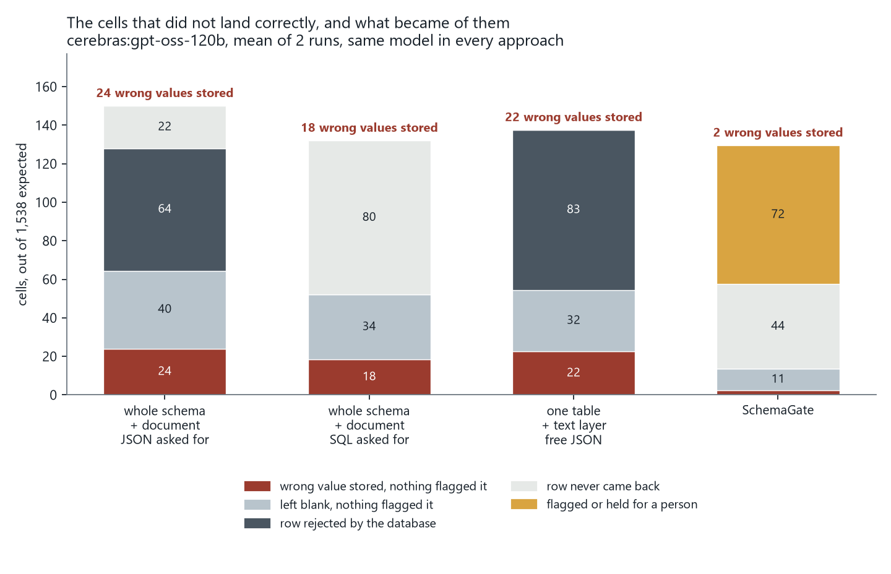
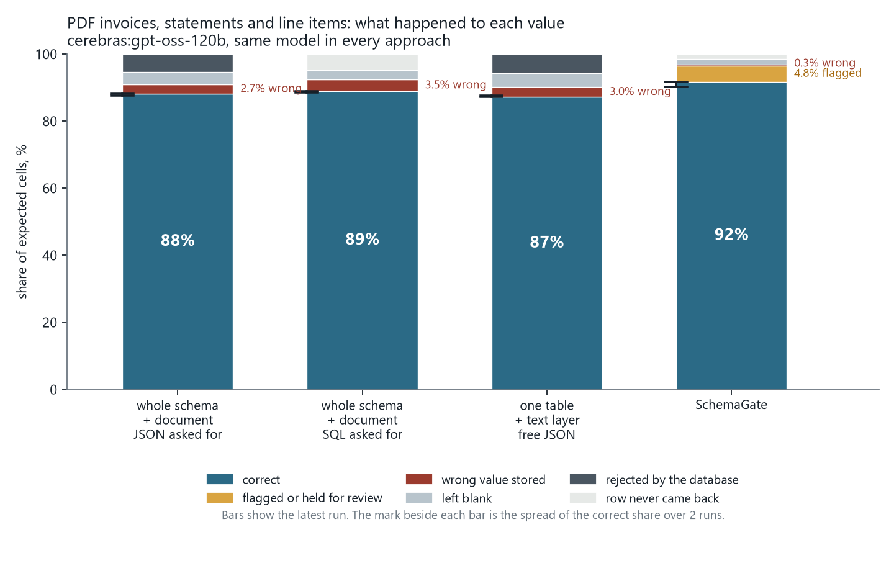
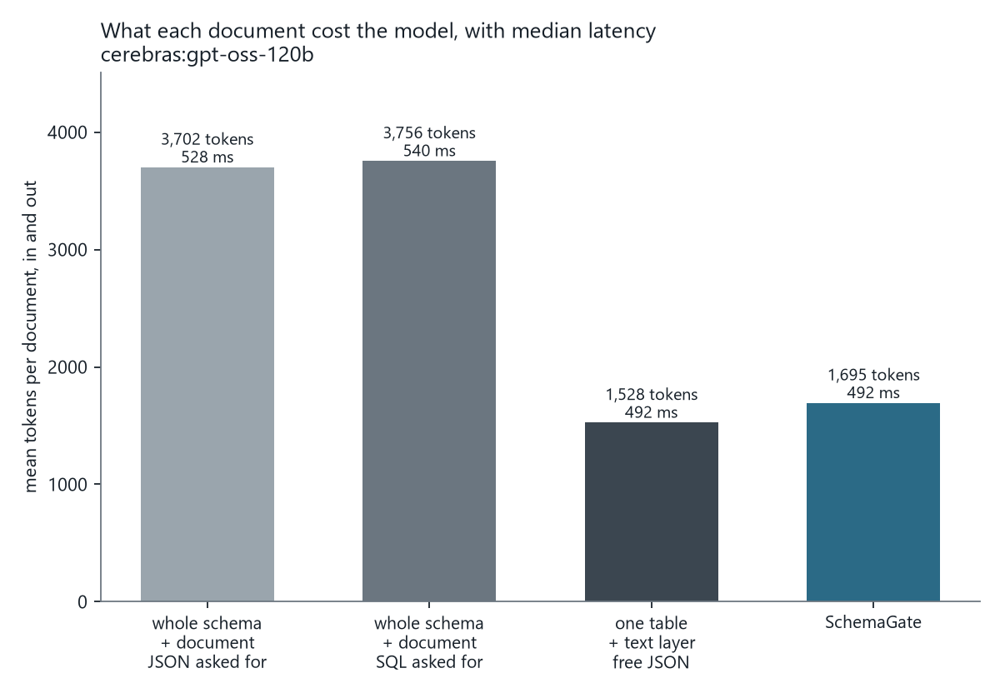
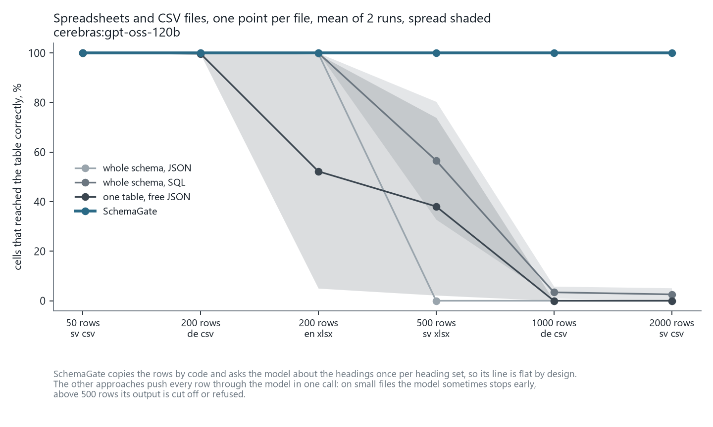

# Ingestion benchmark

What happens between a document and a PostgreSQL table, measured four ways with the same
model.

The model reads the document in every approach. What differs is what it is given and what
happens to its answer: the whole database schema or one table, the PDF itself or its text
layer, free JSON or output constrained to the table, and whether anything checks the values
before they are inserted.

| Approach | Schema sent | Document sent | Output | Checked |
| --- | --- | --- | --- | --- |
| `whole_schema` | every table's DDL | the PDF, image, or CSV text | free JSON | no |
| `whole_schema_sql` | every table's DDL | the PDF, image, or CSV text | INSERT statements | no |
| `one_table_text` | the target table's DDL | the text layer | free JSON | no |
| `schemagate` | the table read from `pg_catalog` | the text layer | constrained to the table | yes |

All four get the same system prompt and the same per-table instructions. The first two are
what most people build first. The third exists to separate the effect of narrowing the schema
from the effect of constrained output and the validation gate.

## What is measured

Every answer is inserted into the real table inside a transaction that is rolled back, so
PostgreSQL decides what is insertable. What was stored is then compared cell by cell with
what the document says.

| Column | Meaning |
| --- | --- |
| cells correct | stored value equals the document's value |
| wrong value stored | a different value was stored and nothing flagged it |
| left blank | NULL was stored where the document had a value, and nothing flagged it; a blank is found on review, a plausible wrong number is not |
| flagged | value differs and the approach reported it |
| held for review | the row had a flagged cell and could not be inserted; it comes back with the failing cell and rule named rather than as a database error |
| rejected by DB | the row failed to insert, with the error class recorded |
| missing | the row never came back |
| phantom cols | keys returned that the table does not have |
| inconsistent docs caught | invoices whose printed total does not add up, and whether the approach said so |
| tokens, cost, ms | per approach, including parsing, with prices from the provider's page |

Rows are paired with the expected rows by the invoice number, the line number, or for a
receipt, by being the only row. A row with the wrong key counts as missing.

Models are not deterministic, and the hosted ones do not all honour a temperature. The same
case can pass on one run and lose a cell on the next, so a difference of a few cells between
two approaches is noise, and a difference in whole rows or in what was flagged is not. Run
the set more than once before quoting a number.

## The database

`schema.sql` is a small ERP of twenty-four tables. Three are extraction targets:
`invoices`, `invoice_lines` and `expense_claims`. The rest exist because a real database has
them, and because two of the approaches send the whole schema on every request. The
hand-written file is used as the "whole schema" rather than `pg_dump` output, which is
three times longer, so the approach that sends it is not charged for a verbose dump.

The column comments are part of the benchmark. Every approach sees them, as DDL or as field
descriptions, and several were sharpened after auditing the first runs: the seller VAT number
is described with the labels it carries in each country, a line description is "the item text
only, without a position or article number", and `invoices` has a `shipping` column so that
`subtotal` means the printed net after discount and the arithmetic rule reads
`subtotal + shipping + tax = total`. Before that column existed the ground truth asked for a
subtotal that included freight, which no document prints, and every approach was scored wrong
for copying what the invoice said.

## The documents

Generated by `generate.py`, seeded, so the set is reproducible and contains no real
company's invoice. 88 cases, 4,123 expected rows, 45,084 cells.

| Kind | Cases | Target | What makes it hard |
| --- | --- | --- | --- |
| invoice | 45 | invoices | five locales, buyer VAT next to seller VAT, invoice, delivery and due dates together, discount and shipping lines, mixed tax rates, dates as words, `1 234,56` and `1.234,56` and `1,234.56`; five have a printed total that does not add up |
| invoice_lines | 15 | invoice_lines | the same PDFs, one row per line item, skipping discount and shipping |
| statement | 10 | invoices | three to six invoices in one table, some with a credit note between them |
| receipt | 12 | expense_claims | till receipts as slightly rotated, softened photographs; category is a judgement |
| tabular | 6 | invoices | Swedish and German headings, 50 to 2,000 rows, CSV and XLSX |

No two suppliers' invoices share a layout. Eight visual families are used: a plain
two-column invoice, a colour band with a boxed reference grid, a sparse single-column form,
a Nordic invoice with a payment slip and an OCR number, a wordmark with a coloured total, a
monospaced ERP printout with dotted leaders, a German letter with an address window and
both parties' VAT numbers in one box, and a US letter with Bill To, Ship To and an Amount
Paid line. Statements come in four shapes: net and tax per line, a type column with credit
notes as negative lines, a running balance in monospace, and a paid or unpaid status
column. Receipts come in three. Fonts are taken from the system where present and fall back
to the PDF core fonts, so the text layer is identical on every machine.

The US supplier prints an EIN, which is not a VAT number. The column comment says so, and
the expected `vat_id` is null. Where a layout prints no per-line tax rate or no due date,
that value is not scored.

## Results

Two full runs on 2 September 2026 with gpt-oss-120b on Cerebras, the same model in every
approach. A text-only model, so the 12 receipt photographs were not attempted and the
whole-schema approaches were handed each PDF's text layer rather than the PDF. Every approach
therefore read the same text, the same column comments, and the same two sentences an operator
would write: who the buyer is, and that a statement's header VAT number applies to every row.
What differs is the schema it was given, whether the output was constrained, and whether
anything checked the values. Each run cost about 80 cents.

Reading accuracy is the same for every approach, so the first chart shows only the cells that
did not land correctly, about 9% of the total, and what became of them. The second shows every
cell.





Documents that need a model: 70 cases, 172 rows, 1,538 cells. Where the two runs differ the
range is given.

| Approach | Cells correct | Wrong value stored | Left blank | Flagged | Held for review | Rejected by DB | Rows never returned | Inconsistent invoices caught | Tokens per document | Cost per document |
| --- | --- | --- | --- | --- | --- | --- | --- | --- | --- | --- |
| whole schema + document, JSON | 90 to 91% | 14 to 34 | 37 to 44 | 0 | 0 | 44 to 83 | 11 to 33 | 0 of 5 | 3,860 | 0.16¢ |
| whole schema + document, SQL | 90 to 92% | 11 to 26 | 24 to 43 | 0 | 0 | 0 | 77 to 83 | 0 of 5 | 3,940 | 0.16¢ |
| one table + text, free JSON | 91% | 18 to 27 | 32 | 0 | 0 | 83 | 0 | 0 of 5 | 1,630 | 0.08¢ |
| SchemaGate | 91 to 92% | 2 to 3 | 11 | 35 to 39 | 28 to 42 | 0 | 44 | 5 of 5 | 1,780 | 0.08¢ |



Spreadsheets and CSV files, six cases from 50 to 2,000 rows:



| Approach | 50 rows | 200 rows, German headings | 200 rows, English headings | 500 rows | 1,000 rows | 2,000 rows | Cost for the six files |
| --- | --- | --- | --- | --- | --- | --- | --- |
| whole schema + document, JSON | 100% | 21 to 100% | 0 to 18% | 0 to 2% | 0% | 0 to 6% | 11 to 15¢ |
| whole schema + document, SQL | 100% | 11 to 100% | 27 to 100% | 9 to 84% | 2 to 42% | 4 to 9% | 15¢ |
| one table + text, free JSON | 100% | 0 to 100% | 13 to 100% | 0% | 0% | 0% | 8 to 13¢ |
| SchemaGate | 100% | 100% | 100% | 100% | 100% | 100% | 0.09¢ |

SchemaGate reads the six files in 8 to 56 ms each. The two files with matching English
headings and repeated German headings cost it nothing at all, since one heading match is
cached for the next file with the same headings.

What the numbers say:

- Reading accuracy is the same for everyone. Every approach reads 90 to 92% of cells, and the spread between two runs of one approach is about as wide as the spread between approaches. Same model, same text: narrowing the schema and constraining the output did not make it read better.
- What happens to a wrong value is not the same. SchemaGate stored 2 to 3 wrong values in 1,538 cells, two tenths of a percent: one delivery date taken as the invoice date, one invoice number copied into the purchase-order field. The other approaches stored 11 to 34. SchemaGate flagged or held 63 to 81 cells for a person, which no other approach can report, and Postgres rejected none of its rows; the naive JSON approaches lost 44 to 83 cells to type and not-null errors a caller would have to decode.
- The five invoices whose totals do not add up were reported in both runs, five of five. No other approach can notice this.
- Good column comments helped everyone, and a fair benchmark says so. Auditing the earlier runs showed the commonest miss was the ground truth's, not the model's: subtotal was expected to include freight, which no invoice prints. With a `shipping` column, and comments that name the VAT labels each country uses and say a description carries no position number, the naive approaches' wrong values fell from 38 to 56 to 11 to 34. SchemaGate's fell from 57 to 2 to 3, because the rules turn the rest into flags.
- Held for review is the gate refusing a misread. On Swedish layouts the tax-rate column sits beside an amount written with a space as the thousands separator, so `12` and `2 940,00` reach the text layer as `12 2 940,00` and the model reads one number. The product rule on line items catches every one. On the densest monospaced statement the model took the running balance for the total and left the tax empty; those rows came back held with the failing cell named. A vision model would not have either problem; a text-layer model always will, which is why the rules stay.
- Left blank is now small. SchemaGate stored NULL for 11 values the documents carried, down from 52 before the comments were sharpened. The others left 24 to 44 blank.
- Rows never returned are one layout. 44 cells, all from the two monospaced running-balance statements, where the model still sometimes returns two invoices of five. Every approach loses rows there.
- Spreadsheets are not a contest. Rows are copied by code and cannot be dropped or altered, one heading match is cached per supplier, and 4,000 rows cost less than a tenth of a cent in total. The naive approaches are unreliable from 200 rows and collapse above 500: the model stops early, refuses, or its JSON is cut off.

## Running it

Needs a PostgreSQL to insert into. A throwaway one:

```console
$ docker run -d --name schemagate-bench-pg -e POSTGRES_USER=bench -e POSTGRES_PASSWORD=bench \
    -e POSTGRES_DB=erp -p 55433:5432 postgres:17
$ docker exec -i schemagate-bench-pg psql -U bench -d erp -v ON_ERROR_STOP=1 < bench/schema.sql
```

Then:

```console
$ uv run python bench/generate.py
$ uv run python bench/run.py run --perfect           # ground truth inserts and scores 100%
$ uv run python bench/run.py run --models cerebras:gpt-oss-120b
$ uv run python bench/run.py run --models anthropic:claude-haiku-4-5 anthropic:claude-sonnet-5
$ uv run python bench/run.py report                  # writes results/summary.md
```

A model is named `provider:model`, and every provider the pipeline supports is a row in the
same table: `anthropic`, `openai`, `cerebras`, `groq`, `together`, `fireworks`, `deepinfra`
and `ollama`. Keys are read from the environment or `.env` under the usual names
(`ANTHROPIC_API_KEY`, `CEREBRAS_API_KEY`, `GROQ_API_KEY`, and so on). An Anthropic key that
acts in more than one workspace also needs `ANTHROPIC_WORKSPACE_ID`. Ollama needs none.

Prices come from `prices.json`, keyed the same way. A model with no entry reports tokens and
no cost, and counts as free against the budget, which is right for a local model and wrong
for a hosted one you forgot to add.

Not every model takes every document. A text-only model such as gpt-oss cannot read the
receipt photographs, so those cases are recorded as not attempted rather than scored, and the
whole-schema approach hands it a PDF's text layer instead of the PDF. A vision model on a host
that does not accept PDFs gets the pages as images. The report says which happened for every
case, since it changes what the comparison means: against a text-only model, the whole-schema
approach and the pipeline read the same text, and the difference is the schema, the constraint
and the gate alone.

A provider that speaks the OpenAI API may decline schema-constrained output for a given
model. The pipeline then asks for plain JSON and validates it itself, and both the pipeline's
`stages` and the report say so.

Results are written one file per model, approach and case under `results/raw/`, with the
rows the approach returned and the gate's failures, so a miss can be audited without another
call. A run skips what is already there, so an interrupted run resumes and a single case can
be redone with `--redo --cases <id>`. `BENCH_RESULTS=<dir>` writes to another directory, for
an audit run that should not disturb published results. Every run calls a real model and is billed. `--limit` and
`--kinds` narrow it, and `--budget-usd` stops the run once that much has been spent, at
$1 by default. Each line printed carries the cost of that call and the running total.

A small comparison, ten invoices, the naive approach against the pipeline:

```console
$ uv run python bench/run.py run --models claude-sonnet-5 --kinds invoice --limit 10 \
    --conditions whole_schema schemagate
```

That is twenty calls and about 25 cents.

`--max-tabular-rows N` sends tabular files above N rows through `schemagate` only, since the
other approaches put every row through the model and a 2,000 row file costs accordingly.
